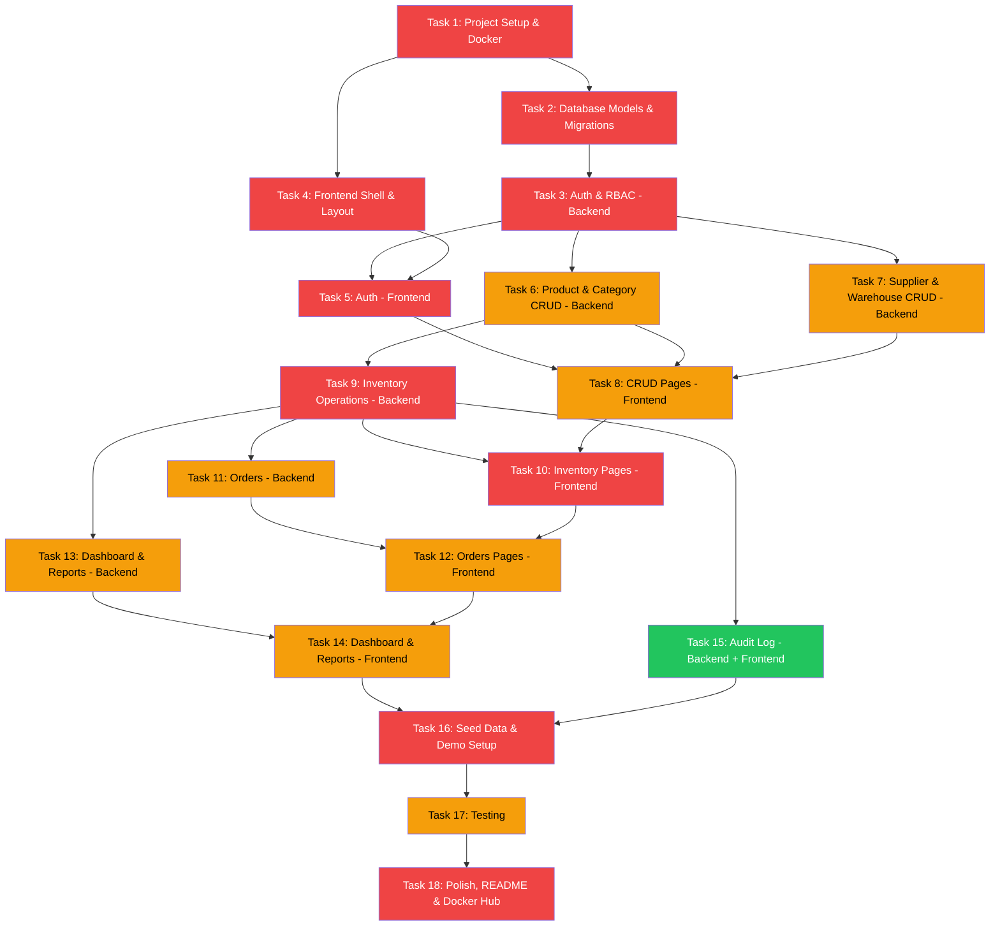

# 📦 Inventory Management System — Execution Plan v2

> **Assessment**: Ethara AI — Software Engineer
> **Stack**: React + Vite + TypeScript | Python FastAPI + SQLAlchemy | PostgreSQL + Redis | Docker
> **Deliverables**: Frontend Repo, Backend Repo, Docker Image

---

## 📌 Key Decisions

| Decision | Choice | Rationale |
|---|---|---|
| **Frontend** | React 19 + Vite + TypeScript | Lightweight SPA, fast builds, clean separation from API |
| **UI** | Tailwind CSS + shadcn/ui + Lucide icons | Modern, accessible, production-quality components |
| **Backend** | Python 3.12 + FastAPI + Pydantic v2 | Auto Swagger docs, async, type-safe validation |
| **ORM** | SQLAlchemy 2.0 (async) + Alembic | Mature, async support, migration versioning |
| **Database** | PostgreSQL 16 | ACID, JSONB, CHECK constraints, industry standard |
| **Cache** | Redis 7 | JWT token blacklisting (logout), rate limiting on auth endpoints |
| **Auth** | JWT (access 30m + refresh 7d) | Stateless, scalable. Refresh stored in DB. |
| **Roles** | Admin → Manager → Staff | 3-tier RBAC. Public registration creates STAFF only. |
| **Docker** | docker-compose (4 services) | One-command `docker-compose up` |
| **API Routing** | nginx reverse proxy `/api` → backend | Frontend uses relative URLs, no CORS issues in prod |
| **Image Handling** | URL-based (paste image URL) | No file upload complexity for assessment scope |

---

## 🗂️ Repo Structure Decision

> **Assignment says**: "Upload links for your Frontend Repository, Backend Repository, Docker Repository/Image"

**Approach**: **Monorepo** with `frontend/` and `backend/` as subdirectories.

**Why**: Docker-compose needs both services in one place. Submit the same repo URL for both form fields — this is standard practice and the docker-compose at root proves they work together.

```
inventory-management/                  ← Single GitHub repo
├── frontend/                          ← React + Vite app
│   └── Dockerfile
├── backend/                           ← FastAPI app
│   └── Dockerfile
├── docker-compose.yml                 ← Orchestrates all 4 services
├── docker-compose.dev.yml             ← Dev overrides (volume mounts, hot reload)
├── .env.example                       ← All environment variables documented
├── .gitignore                         ← Python + Node combined
├── .dockerignore                      ← Exclude .git, node_modules, __pycache__, .env
├── commit-as-rrr.sh
├── README.md                          ← Professional docs + screenshots
└── assigmeind.md
```

---

## 🌐 Networking: How Frontend Talks to Backend

```
Browser → http://localhost:3000/products     → nginx serves React SPA
Browser → http://localhost:3000/api/v1/...   → nginx proxies to backend:8000

┌─────────────────────────────────────────────┐
│  nginx (frontend container, port 3000:80)   │
│                                             │
│  location / {                               │
│    try_files $uri $uri/ /index.html;  ←── SPA routing (no 404 on refresh)
│  }                                          │
│                                             │
│  location /api/ {                           │
│    proxy_pass http://backend:8000;    ←── Reverse proxy to FastAPI
│    proxy_set_header Host $host;             │
│    proxy_set_header X-Real-IP $remote_addr; │
│  }                                          │
│                                             │
│  location /docs {                           │
│    proxy_pass http://backend:8000;    ←── Swagger UI accessible
│  }                                          │
└─────────────────────────────────────────────┘
```

**Result**: Frontend uses relative URLs (`axios.get('/api/v1/products')`). No CORS issues. No hardcoded URLs. Works the same in dev and prod.

**CORS**: Still configured on FastAPI as a fallback for development without nginx (direct `localhost:8000` calls during dev).

---

## 🔄 Build Order & Dependencies



> 🔴 Critical | 🟡 High | 🟢 Medium

---

## 🗄️ Database Schema (12 Entities)

### Base Model (inherited by all)
```
id          UUID PRIMARY KEY DEFAULT gen_random_uuid()
created_at  TIMESTAMP NOT NULL DEFAULT now()
updated_at  TIMESTAMP NOT NULL DEFAULT now()  -- auto-update via trigger or ORM event
```

### Entity Definitions

#### `users`
| Column | Type | Constraints |
|---|---|---|
| email | VARCHAR(255) | UNIQUE, NOT NULL, INDEX |
| password_hash | VARCHAR(255) | NOT NULL |
| name | VARCHAR(100) | NOT NULL |
| role | ENUM('ADMIN','MANAGER','STAFF') | NOT NULL, DEFAULT 'STAFF' |
| is_active | BOOLEAN | DEFAULT true |
| last_login | TIMESTAMP | NULLABLE |

**Validation**: email format, password min 8 chars (1 uppercase, 1 number), name 2-100 chars.

#### `categories`
| Column | Type | Constraints |
|---|---|---|
| name | VARCHAR(100) | UNIQUE, NOT NULL |
| description | TEXT | NULLABLE |
| parent_id | UUID FK → categories.id | NULLABLE, ON DELETE SET NULL |

**Tree strategy**: Adjacency list with recursive CTE query for tree response. Max depth: 3 levels (enforced in service layer). Circular reference prevented by checking ancestry chain before update.

#### `suppliers`
| Column | Type | Constraints |
|---|---|---|
| name | VARCHAR(200) | NOT NULL |
| email | VARCHAR(255) | NULLABLE, email format validated |
| phone | VARCHAR(20) | NULLABLE |
| address | TEXT | NULLABLE |
| lead_time_days | INTEGER | DEFAULT 0, CHECK >= 0 |
| is_active | BOOLEAN | DEFAULT true |

#### `products`
| Column | Type | Constraints |
|---|---|---|
| sku | VARCHAR(50) | UNIQUE, NOT NULL, INDEX |
| name | VARCHAR(200) | NOT NULL |
| description | TEXT | NULLABLE |
| category_id | UUID FK → categories.id | NULLABLE, ON DELETE SET NULL |
| supplier_id | UUID FK → suppliers.id | NULLABLE, ON DELETE SET NULL |
| unit_price | DECIMAL(12,2) | NOT NULL, CHECK > 0 |
| cost_price | DECIMAL(12,2) | NOT NULL, CHECK > 0 |
| image_url | VARCHAR(500) | NULLABLE (paste URL, no upload) |
| barcode | VARCHAR(100) | NULLABLE, UNIQUE |
| is_active | BOOLEAN | DEFAULT true (soft delete) |

**Validation**: SKU alphanumeric + hyphens, price > 0, cost_price > 0.

#### `warehouses`
| Column | Type | Constraints |
|---|---|---|
| name | VARCHAR(200) | NOT NULL, UNIQUE |
| address | TEXT | NULLABLE |
| is_active | BOOLEAN | DEFAULT true |

#### `inventory`
| Column | Type | Constraints |
|---|---|---|
| product_id | UUID FK → products.id | NOT NULL, ON DELETE RESTRICT |
| warehouse_id | UUID FK → warehouses.id | NOT NULL, ON DELETE RESTRICT |
| quantity_available | INTEGER | NOT NULL, DEFAULT 0, CHECK >= 0 |
| reserved_quantity | INTEGER | NOT NULL, DEFAULT 0, CHECK >= 0 |
| min_threshold | INTEGER | DEFAULT 10, CHECK >= 0 |
| reorder_point | INTEGER | DEFAULT 20, CHECK >= 0 |
| version | INTEGER | DEFAULT 1 (optimistic locking) |

**Constraints**:
- `UNIQUE(product_id, warehouse_id)` — one record per product per warehouse
- `CHECK(quantity_available >= 0)` — prevents negative stock at DB level
- `CHECK(reserved_quantity >= 0)`

#### `inventory_transactions`
| Column | Type | Constraints |
|---|---|---|
| product_id | UUID FK → products.id | NOT NULL |
| warehouse_id | UUID FK → warehouses.id | NOT NULL |
| quantity | INTEGER | NOT NULL (positive for in, negative for out) |
| type | ENUM | NOT NULL: PURCHASE, SALE, TRANSFER_IN, TRANSFER_OUT, ADJUSTMENT, RETURN |
| reference_number | VARCHAR(100) | NULLABLE (PO/SO number) |
| reason | VARCHAR(500) | NULLABLE |
| user_id | UUID FK → users.id | NOT NULL |

**Indexes**: `(product_id)`, `(warehouse_id)`, `(created_at)`, `(type)`

#### `purchase_orders`
| Column | Type | Constraints |
|---|---|---|
| supplier_id | UUID FK → suppliers.id | NOT NULL, ON DELETE RESTRICT |
| status | ENUM | NOT NULL, DEFAULT 'DRAFT': DRAFT, ORDERED, PARTIAL, RECEIVED, CANCELLED |
| order_date | DATE | NOT NULL |
| expected_date | DATE | NULLABLE |
| total_amount | DECIMAL(14,2) | NOT NULL, DEFAULT 0 |
| notes | TEXT | NULLABLE |
| created_by | UUID FK → users.id | NOT NULL |

**Status transitions**: DRAFT→ORDERED→PARTIAL→RECEIVED, DRAFT→CANCELLED, ORDERED→CANCELLED

#### `purchase_order_items`
| Column | Type | Constraints |
|---|---|---|
| purchase_order_id | UUID FK → purchase_orders.id | NOT NULL, ON DELETE CASCADE |
| product_id | UUID FK → products.id | NOT NULL, ON DELETE RESTRICT |
| quantity_ordered | INTEGER | NOT NULL, CHECK > 0 |
| quantity_received | INTEGER | DEFAULT 0, CHECK >= 0 |
| unit_price | DECIMAL(12,2) | NOT NULL, CHECK > 0 |

#### `sales_orders`
| Column | Type | Constraints |
|---|---|---|
| customer_name | VARCHAR(200) | NOT NULL |
| customer_email | VARCHAR(255) | NULLABLE |
| warehouse_id | UUID FK → warehouses.id | NOT NULL (which warehouse to ship from) |
| status | ENUM | NOT NULL, DEFAULT 'PENDING': PENDING, CONFIRMED, PROCESSING, SHIPPED, DELIVERED, CANCELLED |
| total_amount | DECIMAL(14,2) | NOT NULL, DEFAULT 0 |
| created_by | UUID FK → users.id | NOT NULL |

**Status transitions**: PENDING→CONFIRMED→PROCESSING→SHIPPED→DELIVERED, any(except DELIVERED)→CANCELLED

#### `sales_order_items`
| Column | Type | Constraints |
|---|---|---|
| sales_order_id | UUID FK → sales_orders.id | NOT NULL, ON DELETE CASCADE |
| product_id | UUID FK → products.id | NOT NULL, ON DELETE RESTRICT |
| quantity | INTEGER | NOT NULL, CHECK > 0 |
| unit_price | DECIMAL(12,2) | NOT NULL, CHECK > 0 |

#### `audit_logs`
| Column | Type | Constraints |
|---|---|---|
| entity_type | VARCHAR(50) | NOT NULL (e.g., 'product', 'inventory') |
| entity_id | UUID | NOT NULL |
| action | ENUM('CREATE','UPDATE','DELETE') | NOT NULL |
| old_values | JSONB | NULLABLE |
| new_values | JSONB | NULLABLE |
| user_id | UUID FK → users.id | NOT NULL |
| ip_address | VARCHAR(45) | NULLABLE |

**Indexes**: `(entity_type, entity_id)`, `(user_id)`, `(created_at)`

### Delete Protection Strategy

| Entity | On Delete | Reason |
|---|---|---|
| Category with products | SET NULL on products.category_id | Products become uncategorized |
| Category with children | SET NULL on child.parent_id | Children become root-level |
| Supplier with products | SET NULL on products.supplier_id | Products keep existing |
| Supplier with POs | RESTRICT (block delete) | Can't delete supplier with orders |
| Product with inventory | RESTRICT (block delete) | Must remove inventory first |
| Product with order items | RESTRICT (block delete) | Can't delete ordered products |
| Warehouse with inventory | RESTRICT (block delete) | Must transfer/remove stock first |
| User with audit logs | RESTRICT (block delete) | Preserve audit trail |

---

## 🔐 Authentication & Authorization Detail

### Token Flow
```
Register → POST /auth/register (creates STAFF user, only Admin can assign ADMIN/MANAGER roles)
Login    → POST /auth/login → { access_token (30m), refresh_token (7d) }
Refresh  → POST /auth/refresh → { access_token (new) }
Logout   → POST /auth/logout → blacklist access_token in Redis (TTL = remaining expiry)
Profile  → GET /auth/me → user info
Update   → PATCH /auth/me → update name, password
```

### Refresh Token Storage
- Stored in `users` table: `refresh_token` column (hashed) + `refresh_token_expires_at`
- On refresh: validate token, check not expired, issue new access token
- On logout: clear refresh token from DB + blacklist current access token in Redis

### RBAC Permissions Matrix

| Endpoint | ADMIN | MANAGER | STAFF |
|---|---|---|---|
| View all data | ✅ | ✅ | ✅ |
| Create/Edit products, categories, suppliers | ✅ | ✅ | ❌ |
| Delete anything | ✅ | ❌ | ❌ |
| Adjust/transfer inventory | ✅ | ✅ | ❌ |
| Create/manage orders | ✅ | ✅ | ✅ (create only) |
| View audit logs | ✅ | ✅ | ❌ |
| Manage users | ✅ | ❌ | ❌ |
| View reports | ✅ | ✅ | ❌ |

### Register Security
- `POST /auth/register` — public, but always creates **STAFF** role
- Only ADMIN can change a user's role via `PATCH /users/{id}/role`
- First user created is auto-assigned ADMIN role (bootstrap)

---

## 🔌 API Endpoints (Complete)

### Consistent Response Format

**Success**:
```json
{
  "success": true,
  "message": "Products retrieved successfully",
  "data": { ... },
  "pagination": {
    "page": 1,
    "limit": 20,
    "total": 150,
    "total_pages": 8
  }
}
```

**Error**:
```json
{
  "success": false,
  "message": "Product with SKU 'ABC-123' already exists",
  "error": {
    "code": "DUPLICATE_SKU",
    "details": [
      { "field": "sku", "message": "SKU must be unique" }
    ]
  }
}
```

**Error Codes**: VALIDATION_ERROR, NOT_FOUND, DUPLICATE_ENTRY, UNAUTHORIZED, FORBIDDEN, INSUFFICIENT_STOCK, INVALID_STATUS_TRANSITION, OPTIMISTIC_LOCK_CONFLICT

### Auth (`/api/v1/auth`)
| Method | Endpoint | Description | Auth |
|---|---|---|---|
| `POST` | `/register` | Register (always STAFF role) | ❌ |
| `POST` | `/login` | Login → access + refresh tokens | ❌ |
| `POST` | `/refresh` | New access token from refresh | ✅ (refresh token) |
| `POST` | `/logout` | Blacklist token in Redis | ✅ |
| `GET` | `/me` | Get current user profile | ✅ |
| `PATCH` | `/me` | Update name, password | ✅ |

### Users (`/api/v1/users`) — Admin only
| Method | Endpoint | Description | Auth |
|---|---|---|---|
| `GET` | `/` | List all users | ✅ Admin |
| `PATCH` | `/{id}/role` | Change user role | ✅ Admin |
| `PATCH` | `/{id}/status` | Activate/deactivate user | ✅ Admin |

### Products (`/api/v1/products`)
| Method | Endpoint | Description | Auth |
|---|---|---|---|
| `GET` | `/` | List with `?search=&category_id=&supplier_id=&is_active=&sort_by=&order=&page=&limit=` | ✅ |
| `GET` | `/{id}` | Get single product with category & supplier details | ✅ |
| `POST` | `/` | Create product | ✅ Admin/Manager |
| `PATCH` | `/{id}` | Update product | ✅ Admin/Manager |
| `DELETE` | `/{id}` | Soft-delete (set is_active=false) | ✅ Admin |

### Categories (`/api/v1/categories`)
| Method | Endpoint | Description | Auth |
|---|---|---|---|
| `GET` | `/` | List all as flat list or `?tree=true` for tree | ✅ |
| `GET` | `/{id}` | Get single category with products count | ✅ |
| `POST` | `/` | Create category (validate parent depth ≤ 3) | ✅ Admin/Manager |
| `PATCH` | `/{id}` | Update (validate no circular ref) | ✅ Admin/Manager |
| `DELETE` | `/{id}` | Delete (children become root-level) | ✅ Admin |

### Suppliers (`/api/v1/suppliers`)
| Method | Endpoint | Description | Auth |
|---|---|---|---|
| `GET` | `/` | List with `?search=&is_active=&page=&limit=` | ✅ |
| `GET` | `/{id}` | Get single supplier with products count | ✅ |
| `POST` | `/` | Create supplier | ✅ Admin/Manager |
| `PATCH` | `/{id}` | Update | ✅ Admin/Manager |
| `DELETE` | `/{id}` | Delete (blocked if has POs) | ✅ Admin |

### Warehouses (`/api/v1/warehouses`)
| Method | Endpoint | Description | Auth |
|---|---|---|---|
| `GET` | `/` | List with `?is_active=` | ✅ |
| `GET` | `/{id}` | Get single warehouse with stock summary | ✅ |
| `POST` | `/` | Create warehouse | ✅ Admin |
| `PATCH` | `/{id}` | Update | ✅ Admin |
| `DELETE` | `/{id}` | Delete (blocked if has inventory) | ✅ Admin |

### Inventory (`/api/v1/inventory`)
| Method | Endpoint | Description | Auth |
|---|---|---|---|
| `GET` | `/` | Stock levels with `?warehouse_id=&status=low,out&search=&page=&limit=` | ✅ |
| `GET` | `/{product_id}` | Stock detail for one product (all warehouses) | ✅ |
| `POST` | `/adjust` | Adjust stock (atomic: transaction + update) | ✅ Manager+ |
| `POST` | `/transfer` | Transfer between warehouses (validate from≠to) | ✅ Manager+ |
| `GET` | `/transactions` | Transaction history with `?product_id=&type=&from=&to=&page=&limit=` | ✅ |
| `GET` | `/low-stock` | Products below min_threshold with `?warehouse_id=&page=&limit=` | ✅ |

### Purchase Orders (`/api/v1/purchase-orders`)
| Method | Endpoint | Description | Auth |
|---|---|---|---|
| `GET` | `/` | List with `?status=&supplier_id=&page=&limit=` | ✅ |
| `GET` | `/{id}` | PO detail with items | ✅ |
| `POST` | `/` | Create PO (status: DRAFT) | ✅ Manager+ |
| `PATCH` | `/{id}` | Update PO (only DRAFT status) | ✅ Manager+ |
| `POST` | `/{id}/submit` | DRAFT → ORDERED | ✅ Manager+ |
| `POST` | `/{id}/receive` | Receive goods → update stock atomically | ✅ Manager+ |
| `POST` | `/{id}/cancel` | Cancel PO | ✅ Manager+ |

### Sales Orders (`/api/v1/sales-orders`)
| Method | Endpoint | Description | Auth |
|---|---|---|---|
| `GET` | `/` | List with `?status=&warehouse_id=&page=&limit=` | ✅ |
| `GET` | `/{id}` | SO detail with items | ✅ |
| `POST` | `/` | Create SO (reserves stock from specified warehouse) | ✅ |
| `PATCH` | `/{id}/status` | Transition status (validates allowed transitions) | ✅ Manager+ |
| `POST` | `/{id}/cancel` | Cancel SO → release reserved stock | ✅ Manager+ |

### Dashboard (`/api/v1/dashboard`)
| Method | Endpoint | Response Shape | Auth |
|---|---|---|---|
| `GET` | `/summary` | `{ total_products, total_value, low_stock_count, pending_orders, total_warehouses }` | ✅ |
| `GET` | `/low-stock` | `[{ product_id, name, sku, warehouse, available, threshold }]` (paginated) | ✅ |
| `GET` | `/recent-activity` | `[{ id, type, product_name, quantity, user_name, created_at }]` (last 20) | ✅ |
| `GET` | `/top-products` | `[{ product_id, name, total_sold }]` (top 10) | ✅ |
| `GET` | `/stock-chart` | `[{ date: "2026-01-15", inbound: 50, outbound: 30 }]` (last 30 days) | ✅ |

### Reports (`/api/v1/reports`)
| Method | Endpoint | Description | Auth |
|---|---|---|---|
| `GET` | `/inventory-valuation` | Product-level: qty × cost_price (paginated) | ✅ Manager+ |
| `GET` | `/stock-movement?from=&to=` | Movement report by date range (paginated) | ✅ Manager+ |
| `GET` | `/export/csv` | Download inventory as CSV file | ✅ Manager+ |

### Audit Logs (`/api/v1/audit-logs`)
| Method | Endpoint | Description | Auth |
|---|---|---|---|
| `GET` | `/` | List with `?entity_type=&action=&user_id=&from=&to=&page=&limit=` | ✅ Admin/Manager |

### Health (`/health`)
| Method | Endpoint | Description | Auth |
|---|---|---|---|
| `GET` | `/health` | `{ status: "ok", db: "connected", redis: "connected" }` | ❌ |

---

## 🐳 Docker Setup (Detailed)

### docker-compose.yml
```yaml
services:
  frontend:
    build:
      context: ./frontend
      dockerfile: Dockerfile
    ports:
      - "3000:80"
    depends_on:
      backend:
        condition: service_healthy
    healthcheck:
      test: ["CMD", "wget", "-qO-", "http://localhost/"]
      interval: 30s
      timeout: 3s
      retries: 3

  backend:
    build:
      context: ./backend
      dockerfile: Dockerfile
    ports:
      - "8000:8000"
    depends_on:
      db:
        condition: service_healthy
      redis:
        condition: service_healthy
    environment:
      - DATABASE_URL=postgresql+asyncpg://postgres:postgres@db:5432/inventory
      - REDIS_URL=redis://redis:6379/0
      - JWT_SECRET=${JWT_SECRET:-super-secret-change-in-production}
      - JWT_ALGORITHM=HS256
      - ACCESS_TOKEN_EXPIRE_MINUTES=30
      - REFRESH_TOKEN_EXPIRE_DAYS=7
      - CORS_ORIGINS=http://localhost:3000
      - ENVIRONMENT=production
    healthcheck:
      test: ["CMD", "python", "-c", "import urllib.request; urllib.request.urlopen('http://localhost:8000/health')"]
      interval: 10s
      timeout: 5s
      retries: 5
      start_period: 30s

  db:
    image: postgres:16-alpine
    volumes:
      - pgdata:/var/lib/postgresql/data
    environment:
      - POSTGRES_DB=inventory
      - POSTGRES_USER=postgres
      - POSTGRES_PASSWORD=postgres
    healthcheck:
      test: ["CMD-SHELL", "pg_isready -U postgres"]
      interval: 5s
      timeout: 5s
      retries: 5
    ports:
      - "5432:5432"

  redis:
    image: redis:7-alpine
    ports:
      - "6379:6379"
    healthcheck:
      test: ["CMD", "redis-cli", "ping"]
      interval: 5s
      timeout: 5s
      retries: 5

volumes:
  pgdata:
```

### docker-compose.dev.yml (Dev Overrides)
```yaml
services:
  frontend:
    build: !reset null
    image: node:20-alpine
    working_dir: /app
    command: npm run dev -- --host 0.0.0.0 --port 3000
    volumes:
      - ./frontend:/app
      - /app/node_modules
    ports:
      - "3000:3000"

  backend:
    build: !reset null
    image: python:3.12-slim
    working_dir: /app
    command: uvicorn app.main:app --host 0.0.0.0 --port 8000 --reload
    volumes:
      - ./backend:/app
    environment:
      - ENVIRONMENT=development
```

### Frontend Dockerfile
```dockerfile
FROM node:20-alpine AS builder
WORKDIR /app
COPY package*.json ./
RUN npm ci
COPY . .
RUN npm run build

FROM nginx:alpine AS runner
COPY --from=builder /app/dist /usr/share/nginx/html
COPY nginx.conf /etc/nginx/conf.d/default.conf
EXPOSE 80
HEALTHCHECK --interval=30s --timeout=3s CMD wget -qO- http://localhost/ || exit 1
```

### Frontend nginx.conf
```nginx
server {
    listen 80;
    server_name localhost;
    root /usr/share/nginx/html;
    index index.html;

    # SPA routing — all routes serve index.html
    location / {
        try_files $uri $uri/ /index.html;
    }

    # Reverse proxy API calls to backend
    location /api/ {
        proxy_pass http://backend:8000;
        proxy_set_header Host $host;
        proxy_set_header X-Real-IP $remote_addr;
        proxy_set_header X-Forwarded-For $proxy_add_x_forwarded_for;
        proxy_set_header X-Forwarded-Proto $scheme;
    }

    # Proxy Swagger docs
    location /docs {
        proxy_pass http://backend:8000;
        proxy_set_header Host $host;
    }
    location /openapi.json {
        proxy_pass http://backend:8000;
        proxy_set_header Host $host;
    }

    # Cache static assets
    location ~* \.(js|css|png|jpg|jpeg|gif|ico|svg|woff2?)$ {
        expires 30d;
        add_header Cache-Control "public, immutable";
    }
}
```

### Backend Dockerfile
```dockerfile
FROM python:3.12-slim AS builder
WORKDIR /app
COPY requirements.txt .
RUN pip install --no-cache-dir -r requirements.txt

FROM python:3.12-slim AS runner
RUN addgroup --system app && adduser --system --ingroup app app
WORKDIR /app
COPY --from=builder /usr/local/lib/python3.12/site-packages /usr/local/lib/python3.12/site-packages
COPY --from=builder /usr/local/bin /usr/local/bin
COPY . .
USER app
EXPOSE 8000
HEALTHCHECK --interval=30s --timeout=3s CMD python -c "import urllib.request; urllib.request.urlopen('http://localhost:8000/health')" || exit 1
CMD ["sh", "-c", "alembic upgrade head && python -m app.seeds.seed_data && uvicorn app.main:app --host 0.0.0.0 --port 8000"]
```

### Backend Entrypoint (CMD) Flow
```
1. alembic upgrade head     → Run all pending migrations
2. python -m app.seeds.seed_data  → Seed demo data (idempotent — checks if admin user exists, skips if already seeded)
3. uvicorn app.main:app     → Start the server
```

### .dockerignore
```
.git
.gitignore
__pycache__
*.pyc
.env
.venv
node_modules
.next
dist
*.md
docker-compose*.yml
```

### .env.example
```env
# Database
POSTGRES_DB=inventory
POSTGRES_USER=postgres
POSTGRES_PASSWORD=postgres
DATABASE_URL=postgresql+asyncpg://postgres:postgres@db:5432/inventory

# Redis
REDIS_URL=redis://redis:6379/0

# JWT
JWT_SECRET=change-this-to-a-random-secret-in-production
JWT_ALGORITHM=HS256
ACCESS_TOKEN_EXPIRE_MINUTES=30
REFRESH_TOKEN_EXPIRE_DAYS=7

# CORS (for dev without nginx)
CORS_ORIGINS=http://localhost:3000,http://localhost:5173

# App
ENVIRONMENT=production
```

---

## 🎨 Frontend Detail

### Error Handling Strategy
- **Toast notifications**: react-hot-toast for success/error messages
- **Loading states**: Skeleton components while data loads
- **Empty states**: Illustrated empty state ("No products yet. Create your first product.")
- **Network errors**: Global axios interceptor catches errors, shows toast
- **Form validation**: react-hook-form + zod for client-side validation
- **Error boundary**: Catch React rendering errors with fallback UI

### Search Strategy
- **Debounced search**: 300ms debounce on search input before API call
- **URL sync**: Search/filter params synced to URL query params (bookmarkable, shareable)

### Theme
- Tailwind `dark:` classes with `darkMode: 'class'`
- Theme toggle stores preference in `localStorage`
- System preference detection on first visit

### Responsive Design
- **Desktop (≥1024px)**: Full sidebar + content
- **Tablet (768-1023px)**: Collapsible sidebar (icon-only mode)
- **Mobile (<768px)**: Hidden sidebar, hamburger menu opens overlay sidebar

---

## 📝 Detailed Task Breakdown

### Phase 1: Foundation

---

#### Task 1: Project Setup & Docker
> ⏱️ ~2.5h | 🔴 Critical | No dependencies

**Backend steps**:
1. Create `backend/` directory structure (app/, models/, schemas/, api/, services/, core/, seeds/, tests/)
2. Create `requirements.txt`:
   ```
   fastapi==0.115.*
   uvicorn[standard]==0.32.*
   sqlalchemy[asyncio]==2.0.*
   asyncpg==0.30.*
   alembic==1.14.*
   pydantic[email]==2.*
   pydantic-settings==2.*
   python-jose[cryptography]==3.3.*
   passlib[bcrypt]==1.7.*
   python-multipart==0.0.*
   redis==5.*
   httpx==0.28.*
   ```
3. Create `app/main.py` — FastAPI app with CORS middleware, Swagger config, health endpoint
4. Create `app/config.py` — Pydantic `BaseSettings` loading all env vars with validation
5. Create `app/database.py` — async engine + session factory with connection pool config:
   ```python
   engine = create_async_engine(
       settings.DATABASE_URL,
       pool_size=20,
       max_overflow=10,
       pool_pre_ping=True,
   )
   ```
6. Initialize Alembic (`alembic init alembic`, configure `env.py` for async)
7. Create `Dockerfile` (multi-stage)

**Frontend steps**:
1. `npm create vite@latest ./` — React + TypeScript
2. Install deps:
   ```
   tailwindcss @tailwindcss/vite
   @tanstack/react-query axios zustand
   react-router-dom
   recharts lucide-react
   react-hook-form @hookform/resolvers zod
   react-hot-toast
   clsx tailwind-merge
   ```
3. Install shadcn/ui: `npx shadcn@latest init`
4. Configure `vite.config.ts` with proxy for dev:
   ```ts
   server: { proxy: { '/api': 'http://localhost:8000' } }
   ```
5. Create `Dockerfile` (multi-stage node→nginx)
6. Create `nginx.conf` (SPA routing + API reverse proxy)

**Root**:
1. Create `docker-compose.yml` (4 services with health checks)
2. Create `docker-compose.dev.yml` (dev overrides)
3. Create `.env.example`
4. Create `.dockerignore`
5. Update `.gitignore`

**Verify**: `docker-compose up` → frontend on :3000, backend health at :3000/api/health (via nginx proxy), Swagger at :3000/docs

**Output**: Empty app running in Docker. Health checks pass. Swagger UI visible.

---

#### Task 2: Database Models & Migrations
> ⏱️ ~3h | 🔴 Critical | Depends on: Task 1

**Steps**:
1. Create `models/base.py` — BaseModel with id (UUID), created_at, updated_at
2. Create all 12 model files:
   - `user.py`, `category.py`, `supplier.py`, `product.py`, `warehouse.py`
   - `inventory.py` (with CHECK constraints, UNIQUE composite)
   - `inventory_transaction.py`, `purchase_order.py`, `purchase_order_item.py`
   - `sales_order.py`, `sales_order_item.py`, `audit_log.py`
3. Create Pydantic schemas for each entity:
   - `XxxCreate` (request body for POST)
   - `XxxUpdate` (request body for PATCH, all fields Optional)
   - `XxxResponse` (response body)
   - `XxxListResponse` (with pagination)
4. Create common schemas:
   - `ApiResponse[T]` — generic success/error wrapper
   - `PaginationParams` — page, limit, sort_by, order
   - `ErrorResponse` — with error code and field-level details
5. Add explicit indexes on frequently queried columns
6. Generate Alembic migration: `alembic revision --autogenerate -m "initial"`
7. Test: `alembic upgrade head` creates all tables

**Output**: All models + schemas defined. Migration creates 12 tables with constraints and indexes.

---

#### Task 3: Authentication & RBAC (Backend)
> ⏱️ ~3h | 🔴 Critical | Depends on: Task 2

**Steps**:
1. `core/security.py`:
   - `hash_password()` / `verify_password()` using passlib bcrypt
   - `create_access_token()` / `create_refresh_token()` using python-jose
   - `decode_token()` with expiry validation
2. `api/deps.py`:
   - `get_db()` — async session dependency
   - `get_current_user()` — decode JWT, fetch user, check active
   - `get_current_user_with_roles(*roles)` — factory for role-checking dependency
   - `check_token_blacklist()` — check Redis for blacklisted tokens
3. `services/auth_service.py`:
   - `register()` — hash password, create user (STAFF role), first user = ADMIN
   - `login()` — verify credentials, update last_login, return tokens
   - `refresh()` — validate refresh token from DB, issue new access token
   - `logout()` — blacklist access token in Redis (TTL = remaining time), clear refresh from DB
   - `update_profile()` — update name, change password (requires old password)
4. `api/auth.py` — route handlers for all auth endpoints
5. `api/users.py` — admin-only user management endpoints
6. Add CORS middleware to `main.py`:
   ```python
   app.add_middleware(
       CORSMiddleware,
       allow_origins=settings.CORS_ORIGINS.split(","),
       allow_credentials=True,
       allow_methods=["*"],
       allow_headers=["*"],
   )
   ```
7. Add rate limiting on `/auth/login` (5 attempts per minute per IP using Redis)

**Output**: Full auth system working. Register → Login → Access protected routes → Logout (blacklists token).

---

#### Task 4: Frontend Shell & Layout
> ⏱️ ~3.5h | 🔴 Critical | Depends on: Task 1

**Steps**:
1. Configure Tailwind with custom color palette + dark mode ('class' strategy)
2. Install shadcn components: button, input, dialog, select, badge, table, dropdown-menu, tooltip, card, separator, sheet (mobile menu), skeleton, avatar, sonner (toast)
3. Build `DashboardLayout.tsx`:
   - Sidebar (collapsible: full → icon-only → hidden)
   - Header (breadcrumb, user dropdown, theme toggle)
   - Content area with consistent padding
4. Build `Sidebar.tsx`:
   - Navigation links with icons (Lucide): Dashboard, Products, Categories, Suppliers, Warehouses, Inventory, Purchase Orders, Sales Orders, Reports, Audit Log
   - Active link highlighting
   - Role-based visibility (hide admin-only items for STAFF)
   - Collapse toggle
5. Build `Header.tsx`:
   - Breadcrumb (auto-generated from route)
   - User avatar (initials-based, from name)
   - Role badge
   - Theme toggle (sun/moon icon)
   - Logout button
6. Build reusable components:
   - `DataTable` — using TanStack Table: column sorting, search input, pagination controls, row actions
   - `ConfirmDialog` — "Are you sure?" with customizable title/message
   - `EmptyState` — illustration + message + action button
   - `LoadingSpinner` / `TableSkeleton` — loading states
   - `PageHeader` — title + description + action button (e.g., "Add Product")
7. Set up React Router with all routes (empty page shells)
8. Set up TanStack Query provider
9. Set up Zustand stores (authStore, uiStore)

**Output**: Beautiful, responsive shell. All routes work. Dark/light theme. Reusable components ready.

---

#### Task 5: Authentication (Frontend)
> ⏱️ ~2h | 🔴 Critical | Depends on: Tasks 3 + 4

**Steps**:
1. `api/client.ts` — Axios instance:
   - Base URL: `/api/v1` (relative, works via nginx proxy)
   - Request interceptor: attach `Authorization: Bearer <token>` header
   - Response interceptor: on 401 → try refresh → retry request, or redirect to login
2. `stores/authStore.ts` (Zustand):
   - State: `user`, `accessToken`, `refreshToken`, `isAuthenticated`
   - Actions: `login()`, `logout()`, `setTokens()`, `loadFromStorage()`
   - Persist tokens in `localStorage`
3. `api/auth.api.ts` — login, register, refresh, logout, getMe, updateProfile
4. `pages/auth/LoginPage.tsx`:
   - Email + password form
   - react-hook-form + zod validation
   - Error message display
   - "Don't have an account? Register" link
   - Clean, centered card design
5. `pages/auth/RegisterPage.tsx`:
   - Name + email + password + confirm password
   - Validation rules shown inline
6. `ProtectedRoute.tsx` — wraps dashboard routes, redirects to /login if !authenticated
7. Role-based route guards (e.g., /audit-log only for Admin/Manager)

**Output**: Full auth flow working end-to-end. Login → see dashboard. Logout → redirected to login. Tokens persist across page refresh.

---

### Phase 2: Core CRUD

---

#### Task 6: Product & Category CRUD (Backend)
> ⏱️ ~2.5h | 🟡 High | Depends on: Task 3

**Steps**:
1. `services/category_service.py`:
   - CRUD operations
   - `get_tree()` — recursive CTE or in-Python tree building
   - Validate parent depth ≤ 3
   - Validate no circular references on update
2. `services/product_service.py`:
   - CRUD with soft delete (is_active=false)
   - Filter: search (name/SKU), category_id, supplier_id, is_active
   - Sort: name, sku, unit_price, created_at
   - Pagination: page + limit → offset + count
   - Generate unique SKU suggestion (e.g., CAT-PROD-001)
3. `api/categories.py` + `api/products.py` — route handlers
4. Validate: duplicate SKU returns 409 with DUPLICATE_ENTRY error code

**Output**: Category tree API + Product CRUD with search/filter/pagination.

---

#### Task 7: Supplier & Warehouse CRUD (Backend)
> ⏱️ ~1.5h | 🟡 High | Depends on: Task 3

**Steps**:
1. `services/supplier_service.py` — CRUD + search + is_active filter
2. `services/warehouse_service.py` — CRUD + is_active filter
3. `api/suppliers.py` + `api/warehouses.py` — route handlers
4. Delete protection: supplier with POs → 409, warehouse with inventory → 409

**Output**: Supplier + Warehouse management API.

---

#### Task 8: CRUD Pages (Frontend)
> ⏱️ ~5h | 🟡 High | Depends on: Tasks 5 + 6 + 7

**Each page follows this pattern**:
1. `use<Entity>` hook (TanStack Query): `useProducts()`, `useCreateProduct()`, `useUpdateProduct()`, `useDeleteProduct()`
2. Page with `PageHeader` (title + "Add" button) + `DataTable`
3. Create/Edit dialog form with react-hook-form + zod
4. Delete → ConfirmDialog
5. Toast notifications on success/error
6. Loading skeletons, empty states

**Pages**:
1. **ProductsPage**: DataTable (SKU, Name, Category, Price, Status), search bar, category filter dropdown, create/edit form (SKU, name, description, category select, supplier select, unit_price, cost_price, image_url)
2. **CategoriesPage**: List or simple tree, create/edit form (name, description, parent select)
3. **SuppliersPage**: DataTable (Name, Email, Phone, Lead Time), create/edit form
4. **WarehousesPage**: DataTable (Name, Address, Status), create/edit form

**Output**: 4 fully functional CRUD pages connected to backend.

---

### Phase 3: Inventory & Orders

---

#### Task 9: Inventory Operations (Backend)
> ⏱️ ~4h | 🔴 Critical | Depends on: Task 6

**Steps**:
1. `services/inventory_service.py`:
   - `get_stock_levels()` — join inventory + product, filter by warehouse, status (low/out/ok)
   - `adjust_stock()`:
     ```python
     async with db.begin():
         # 1. Check optimistic lock version
         # 2. Create inventory_transaction record
         # 3. Update inventory.quantity_available (atomic)
         # 4. Increment version
         # 5. If quantity_available < min_threshold → flag as low stock
     ```
   - `transfer_stock()`:
     ```python
     # Validate: from_warehouse != to_warehouse
     async with db.begin():
         # 1. Deduct from source (TRANSFER_OUT transaction)
         # 2. Add to destination (TRANSFER_IN transaction)
         # 3. Create/update inventory records for both warehouses
     ```
   - `get_low_stock()` — products where quantity_available < min_threshold
   - `get_transactions()` — filter by product, type, date range, paginated
2. `api/inventory.py` — route handlers
3. Adjust request schema:
   ```python
   class AdjustStockRequest(BaseModel):
       product_id: UUID
       warehouse_id: UUID
       quantity: int  # positive = add, negative = remove
       type: TransactionType  # ADJUSTMENT, RETURN, etc.
       reason: str  # required, min 3 chars
   ```
4. Transfer request schema:
   ```python
   class TransferStockRequest(BaseModel):
       product_id: UUID
       from_warehouse_id: UUID
       to_warehouse_id: UUID
       quantity: int  # positive, CHECK > 0

       @field_validator('to_warehouse_id')
       def warehouses_must_differ(cls, v, info):
           if v == info.data.get('from_warehouse_id'):
               raise ValueError('Cannot transfer to same warehouse')
           return v
   ```

**Output**: Stock adjust/transfer working. Negative stock blocked. All changes traced.

---

#### Task 10: Inventory Pages (Frontend)
> ⏱️ ~3.5h | 🔴 Critical | Depends on: Tasks 8 + 9

**Pages**:
1. **InventoryPage**:
   - DataTable: Product (SKU + name), Warehouse, Available, Reserved, Threshold, Status badge (OK ✅ / LOW ⚠️ / OUT ❌)
   - Filters: warehouse dropdown, status dropdown (All/Low/Out)
   - Buttons: "Adjust Stock", "Transfer Stock"
2. **AdjustStockModal**: Product select → Warehouse select → Quantity input → Type select → Reason input → Submit
3. **TransferStockModal**: Product → From Warehouse → To Warehouse → Quantity → Submit
4. **TransactionHistoryPage** (or tab): DataTable of all transactions with date, type badge, product, warehouse, quantity (+/-), user, reason. Date range filter.

**Output**: Full inventory management UI with stock adjustment and transfer.

---

#### Task 11: Purchase & Sales Orders (Backend)
> ⏱️ ~4h | 🟡 High | Depends on: Task 9

**Purchase Orders**:
1. `services/purchase_order_service.py`:
   - `create()` — create PO + items (status: DRAFT), calc total
   - `update()` — only in DRAFT status
   - `submit()` — DRAFT → ORDERED (validate has items)
   - `receive()` — accept received quantities per item:
     ```python
     async with db.begin():
         for item in received_items:
             # Update quantity_received on PO item
             # Create PURCHASE inventory transaction
             # Update/create inventory record (+quantity)
         # Update PO status: PARTIAL (some received) or RECEIVED (all received)
     ```
   - `cancel()` — only DRAFT or ORDERED
2. `api/purchase_orders.py`

**Sales Orders**:
1. `services/sales_order_service.py`:
   - `create()` — validate stock available in warehouse, reserve stock:
     ```python
     async with db.begin():
         for item in items:
             # Check inventory.quantity_available >= item.quantity
             # inventory.reserved_quantity += item.quantity
         # Create SO + items
     ```
   - `update_status()` — validate transitions:
     - CONFIRMED→PROCESSING: no-op on stock
     - PROCESSING→SHIPPED: deduct stock (quantity_available -= qty, reserved -= qty, create SALE transaction)
     - Any→CANCELLED: release reserved (reserved_quantity -= qty)
   - `cancel()` — release reserved stock
2. `api/sales_orders.py`

**Output**: Full order lifecycle with automatic stock management.

---

#### Task 12: Order Pages (Frontend)
> ⏱️ ~4h | 🟡 High | Depends on: Tasks 10 + 11

**Pages**:
1. **PurchaseOrdersPage**: DataTable (PO#, Supplier, Status badge, Total, Date), filters by status
2. **CreatePurchaseOrderPage**: Supplier select, add line items (product search + qty + price), running total, submit
3. **PurchaseOrderDetailPage**: View items, receive goods form (enter received qty per item), status timeline
4. **SalesOrdersPage**: DataTable (SO#, Customer, Warehouse, Status, Total, Date), filters
5. **CreateSalesOrderPage**: Customer info, warehouse select, add line items (shows available qty), submit
6. **SalesOrderDetailPage**: View items, status timeline, action buttons (Confirm, Process, Ship, Deliver, Cancel)

**Output**: Full order management UI.

---

### Phase 4: Dashboard & Analytics

---

#### Task 13: Dashboard & Reports (Backend)
> ⏱️ ~2.5h | 🟡 High | Depends on: Task 9

**Steps**:
1. `services/dashboard_service.py`:
   - `get_summary()` — aggregate queries for stat cards
   - `get_low_stock()` — inventory JOIN products WHERE qty < threshold
   - `get_recent_activity()` — latest 20 inventory_transactions with user + product names
   - `get_top_products()` — SUM sales_order_items.quantity GROUP BY product, top 10
   - `get_stock_chart()` — daily SUM of inbound/outbound transactions for last 30 days:
     ```python
     # Response: [{"date": "2026-06-01", "inbound": 150, "outbound": 80}, ...]
     ```
2. `services/report_service.py`:
   - `get_inventory_valuation()` — inventory JOIN products: qty × cost_price per product
   - `get_stock_movement()` — transactions within date range, grouped by product
   - `export_csv()` — generate CSV file of inventory data using Python csv module
3. `api/dashboard.py` + `api/reports.py`

**Output**: All dashboard + report data APIs ready with correct response shapes.

---

#### Task 14: Dashboard & Reports (Frontend)
> ⏱️ ~3.5h | 🟡 High | Depends on: Tasks 12 + 13

**Dashboard page**:
1. **Stat cards** (4-6): Total Products, Total Inventory Value (formatted $), Low Stock Alerts (red if > 0), Pending Orders, Total Warehouses. Each card: icon + label + value + subtle trend color.
2. **Stock Movement Chart**: Recharts `AreaChart` with inbound (green) + outbound (red) lines. Last 30 days. Tooltip on hover.
3. **Top Products Chart**: Recharts horizontal `BarChart`, top 10 by sales.
4. **Low Stock Table**: Compact table (product, warehouse, available, threshold). Row click → navigate to inventory.
5. **Recent Activity**: Feed/timeline of last 10 transactions (icon by type, product name, qty, user, relative time).

**Reports page**:
1. Inventory Valuation table (Product, SKU, Qty, Cost, Total Value) with grand total
2. Stock Movement table with date range picker
3. "Export CSV" button → downloads file

**Output**: Beautiful, data-rich dashboard.

---

#### Task 15: Audit Log (Backend + Frontend)
> ⏱️ ~2.5h | 🟢 Medium | Depends on: Task 9

**Backend**:
1. `services/audit_service.py`:
   - `log_change(entity_type, entity_id, action, old_values, new_values, user_id, ip)`
   - Called from service layer on every CREATE/UPDATE/DELETE
   - `get_logs()` — filter by entity_type, action, user_id, date range. Paginated.
2. `api/audit_logs.py` — list endpoint

**Frontend**:
1. **AuditLogPage**: DataTable (Timestamp, User, Action badge, Entity Type, Entity ID)
2. Expandable row → shows old/new values as JSON diff (green for added, red for removed)
3. Filters: entity type dropdown, action dropdown, date range picker

**Output**: Full audit trail visible.

---

### Phase 5: Polish & Deploy

---

#### Task 16: Seed Data & Demo Setup
> ⏱️ ~2h | 🔴 Critical | Depends on: Tasks 14 + 15

**Seed mechanism**: `backend/app/seeds/seed_data.py`
```python
async def seed():
    # Check if admin user exists → skip if already seeded
    admin = await db.execute(select(User).where(User.email == "admin@inventory.com"))
    if admin.scalar():
        print("Database already seeded. Skipping.")
        return

    # Otherwise, seed everything...
```

**Seed data**:
| Entity | Count | Examples |
|---|---|---|
| Users | 3 | admin@inventory.com (ADMIN, pass: Admin@123), manager@inventory.com (MANAGER, pass: Manager@123), staff@inventory.com (STAFF, pass: Staff@123) |
| Categories | 8 | Electronics, Furniture, Office Supplies, Clothing, Food & Beverage, Tools, Packaging, Raw Materials |
| Suppliers | 5 | TechWorld Supplies, FurnishCo, OfficeMax Direct, TextilePro, FoodSource Inc |
| Warehouses | 3 | Main Warehouse (Delhi), East Hub (Kolkata), West Hub (Mumbai) |
| Products | 50+ | Realistic names, SKUs (ELEC-LAP-001), prices ($50-$5000), assigned to categories/suppliers |
| Inventory | 100+ records | Products distributed across warehouses, some below threshold |
| Transactions | 200+ | Historical stock movements over last 60 days (makes charts look good) |
| Purchase Orders | 12 | Various statuses (3 DRAFT, 3 ORDERED, 3 RECEIVED, 3 CANCELLED) |
| Sales Orders | 15 | Various statuses (3 PENDING, 3 CONFIRMED, 3 SHIPPED, 3 DELIVERED, 3 CANCELLED) |
| Audit Logs | 50+ | Auto-generated from seed operations |

**Output**: Reviewer sees a fully populated, working system immediately after `docker-compose up`.

---

#### Task 17: Testing
> ⏱️ ~3h | 🟡 High | Depends on: Task 16

**Backend tests** (pytest + httpx + pytest-asyncio):
```
tests/
├── conftest.py              ← Test DB setup, test client, auth fixtures
├── test_auth.py             ← Register, login, invalid creds, token refresh, logout, role access
├── test_products.py         ← CRUD, duplicate SKU, soft delete, search, filter, pagination
├── test_inventory.py        ← Adjust +/-, prevent negative, transfer, low-stock, concurrent update
├── test_purchase_orders.py  ← Create, submit, receive → stock update, cancel, invalid transitions
└── test_sales_orders.py     ← Create → reserve, ship → deduct, cancel → release, insufficient stock
```

**Frontend tests** (Vitest + React Testing Library):
```
- LoginPage: renders form, shows validation errors, calls API
- DataTable: renders columns, sorts, paginates
- ProtectedRoute: redirects when not authenticated
```

**Output**: `pytest` + `npm test` pass. Core business logic covered.

---

#### Task 18: Polish, README & Docker Hub
> ⏱️ ~2.5h | 🔴 Critical | Depends on: Task 17

**Polish checklist**:
- [ ] Fresh `docker-compose up` works from clean clone
- [ ] All CRUD operations work
- [ ] Dashboard charts render with seed data
- [ ] Login/logout flow smooth
- [ ] Dark/light theme consistent
- [ ] All error states show user-friendly messages
- [ ] Swagger docs at `http://localhost:3000/docs` — all endpoints documented
- [ ] Mobile responsive (sidebar collapses)
- [ ] No console errors

**README.md sections**:
1. **Overview**: What the app does, key features
2. **Screenshots**: 6-8 screenshots (Dashboard, Products, Inventory, Orders, Dark mode)
3. **Architecture**: Mermaid diagram
4. **Tech Stack**: Table with all technologies + why
5. **Quick Start**: 
   ```bash
   git clone <repo>
   cp .env.example .env
   docker-compose up --build
   # Open http://localhost:3000
   ```
6. **Default Credentials**: Table with admin/manager/staff logins
7. **API Documentation**: Link to `http://localhost:3000/docs`
8. **Project Structure**: Directory tree
9. **Environment Variables**: Table with all vars
10. **Running Tests**: pytest + npm test commands

**Docker Hub**:
- Build and tag images
- Push to Docker Hub
- Add Docker Hub link to README

**Output**: Professional, submission-ready project.

---

## ⏱️ Total Timeline (Revised)

| Phase | Tasks | Est. Time |
|---|---|---|
| **Phase 1**: Foundation | Tasks 1-5 | ~14h |
| **Phase 2**: Core CRUD | Tasks 6-8 | ~9h |
| **Phase 3**: Inventory & Orders | Tasks 9-12 | ~15.5h |
| **Phase 4**: Dashboard & Analytics | Tasks 13-15 | ~8.5h |
| **Phase 5**: Polish & Deploy | Tasks 16-18 | ~7.5h |
| | **Total** | **~54.5h** |

> [!NOTE]
> Estimates include buffer for debugging, integration issues, and Docker troubleshooting. Previous estimate of 41h was too aggressive.

---

## 🏃 Parallel Execution Strategy

```
Backend Agent                          Frontend Agent
────────────                           ──────────────
Task 1 backend (1h)                    Task 1 frontend (1.5h)
    ↓                                      ↓
Task 2 DB models (3h)                  Task 4 UI shell (3.5h)
    ↓                                      ↓
Task 3 Auth backend (3h)  ───→         Task 5 Auth frontend (2h)
    ↓                                      ↓
Task 6 Product CRUD (2.5h)                 │
Task 7 Supplier CRUD (1.5h) ──→        Task 8 CRUD pages (5h)
    ↓                                      ↓
Task 9 Inventory (4h)     ───→         Task 10 Inventory pages (3.5h)
    ↓                                      ↓
Task 11 Orders (4h)       ───→         Task 12 Order pages (4h)
    ↓                                      ↓
Task 13 Dashboard API (2.5h)──→        Task 14 Dashboard UI (3.5h)
Task 15 Audit log (2.5h)                  │
    ↓                                      ↓
         ─── Task 16 Seed data (2h) ───
         ─── Task 17 Testing (3h) ─────
         ─── Task 18 Polish + README (2.5h) ──
```

**Effective time with parallel execution: ~30-35h** (backend and frontend overlap significantly)

---

## ✅ Definition of Done

- [ ] `docker-compose up` → all 4 services healthy (frontend, backend, postgres, redis)
- [ ] Login as Admin (`admin@inventory.com` / `Admin@123`) → populated dashboard
- [ ] CRUD works: Products, Categories, Suppliers, Warehouses
- [ ] Stock adjust/transfer → transaction records created
- [ ] Purchase Order → Receive → Stock automatically updated
- [ ] Sales Order → Reserve → Ship → Stock deducted, Cancel → Stock released
- [ ] Low-stock alerts visible on dashboard
- [ ] Dashboard charts render with real data
- [ ] Audit log tracks all entity changes
- [ ] Swagger docs accessible at `http://localhost:3000/docs`
- [ ] Modern, responsive UI with dark/light theme
- [ ] `pytest` passes on business logic
- [ ] Professional README with screenshots and setup guide
- [ ] Docker images pushed to Docker Hub
- [ ] All API error responses follow consistent format
- [ ] No console errors, no unhandled promise rejections

---

## 🔍 Review Round 1: Issues Fixed

| # | Issue | Severity | Fix Applied |
|---|---|---|---|
| 1 | Separate repos vs monorepo | 🔴 | Clarified monorepo approach with rationale |
| 2 | Frontend API URL in Docker | 🔴 | nginx reverse proxy — frontend uses relative URLs |
| 3 | nginx SPA routing | 🔴 | Explicit `try_files $uri $uri/ /index.html` |
| 4 | CORS missing | 🔴 | Added to Task 3, FastAPI CORSMiddleware |
| 5 | No logout / token blacklisting | 🔴 | Added Redis-based token blacklisting |
| 6 | Unique constraint on inventory | 🔴 | Added `UNIQUE(product_id, warehouse_id)` |
| 7 | Seed auto-run mechanism | 🔴 | Idempotent seed in Docker CMD, checks admin user |
| 8 | Missing PO submit endpoint | 🔴 | Added `POST /purchase-orders/{id}/submit` |
| 9 | Image uploads unaddressed | 🔴 | Clarified URL-based (paste URL, no upload) |
| 10 | Users table missing fields | 🟡 | Added `last_login`, avatar = initials-based |
| 11 | Products missing `is_active` | 🟡 | Added to schema |
| 12 | Missing database indexes | 🟡 | Added explicit index list for all entities |
| 13 | Category tree depth/circular | 🟡 | Max depth 3, circular ref prevention in service |
| 14 | Rate limiting not implemented | 🟡 | Added Redis rate limiting on auth endpoints |
| 15 | No validation details | 🟡 | Added specific rules per entity |
| 16 | No error response schema | 🟡 | Defined error format with codes |
| 17 | No frontend error handling | 🟡 | Added toast, loading, empty state strategy |
| 18 | Sales orders missing warehouse | 🟡 | Added `warehouse_id` to sales_orders |
| 19 | Missing GET by ID endpoints | 🟡 | Added for all entities |
| 20 | No frontend health check | 🟡 | Added wget health check to nginx |
| 21 | Backend DB startup order | 🟡 | `depends_on` with `service_healthy` condition |
| 22 | Refresh token storage | 🟡 | Stored hashed in users table |
| 23 | Junction table PKs | 🟡 | Clarified they use base model UUID PK |
| 24 | No DB connection pooling | 🟡 | Added pool_size=20, max_overflow=10 |
| 25 | Aggressive time estimates | 🟡 | Revised total from 41h → 54.5h |
| 26 | Missing pagination | 🟡 | Added pagination to all list endpoints |
| 27 | No delete protection | 🟡 | Added cascade/restrict strategy table |
| 28 | Register open to all | 🟡 | Public register = STAFF only, first user = ADMIN |
| 29 | No update profile | 🟡 | Added `PATCH /auth/me` |
| 30 | docker-compose.dev.yml empty | 🟡 | Detailed volume mounts + hot reload config |
| 31 | No frontend testing | 🟡 | Added Vitest + RTL tests |
| 32-45 | Nice-to-haves | 🟢 | Added .dockerignore, search debounce, responsive breakpoints, env validation, transfer validation, chart data formats |
